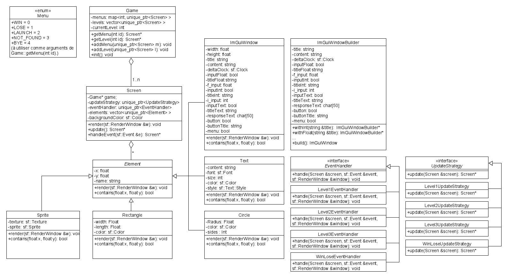

# C++ SFML Quiz minigame

This repo contains the source code for a C++ SFML minigame I made with a friend during a game-jam-like project for a C++ class.

The game is a <a href="https://play.google.com/store/apps/details?id=com.mind.quiz.brain.out">Brain Out</a> clone: each level is a tricky puzzle. You better think outside the box to complete the levels!

# How we made the game

We had a C++ class in engineering school. The final assessment for that class consisted in making a C++ SFML game revolving around the following theme: "Science without conscience is but the ruin of the soul" (Rabelais).

We decided to use the original meaning of the quote, and made a game in which you have to take some time to actually understand what is going on, instead of relying on common knowledge you may have acquired when playing more conventional games.

Due to excessive college work load (yes), we had to rush the implementation of the first version of the game whose source code is available on the main branch. This first version was implemented in 4 days, making the whole project shift to a game-jam-like experience!

# Code structure considerations

We needed to make a game with a unique puzzle for each level. Each level would thus have its unique game logic (moving things around, clicking on specific elements to win or lose, typing an answer in a text bar, and much more...), as well as a unique layout (different visual elements arranged in various ways).

This required we built our own little game engine for the game. In fact, this was the main focus we had during the project. You can find a class diagram of the first version bellow.

In the game, we needed menu screens and level screens. Both are comprised of various visual elements. We thus implemented a Screen class, as well as an Element class.
We then declined the Element class in various subclasses for each new visual element we wanted to include in our levels/menus (shapes, sprites, text zones, pop-up windows, etc...).

Some levels use in-game windows as GUI elements for the player to interact with (type an answer in a text input for instance).  
To create such windows, we used ImGUI along with our ImGuiWindow class. This class can represent a wide variety of windows with different elements in them (radio buttons, text inputs, float inputs, dropdown menus, etc...). Thanks to the builder design pattern (see our ImGuiWindowBuilder class), we can easily customize the content of an in-game ImGUI window.

The layout of each level (the visual elements within the level, their location, and more properties) is stored in an XML file (<code>/resources/setup.xml</code>) which gets parsed with <a href="https://pugixml.org/">pugixml</a> as the game launches. This allows to easily build levels.

Since all levels and menus have their own game logic, we had to figure out a way to make that possible. To do so, we extensively used the strategy design pattern.  
We first decided to split the game logic of each screen into two parts:

<ul>
  <li>Updating the screen on user inputs/events (mouse, keyboard events, etc...).</li>
  <li>Updating the screen when no particular user inputs/events are received (a process we called "spontaneous update").</li>
</ul>

For the first part, we created the EventHandler interface exposing a <code>handle(...)</code> method which needed to be implemented by each event handler subclass representing different strategies for processing user events.  
We did the same for the second part with the UpdateStrategy interface and various subclasses implementing its <code>update(...)</code> method for all the different spontaneous update strategies we needed.

Even if this design is fairly intresting, in the first version of the game, we had the bad idea to bound event handlers and update strategies to screens instead of bounding them to the elements inside those screens. We created 3 initial levels, and each of them required its own specific event handler and update strategy. We thus had as much EventHandler and UpdateStrategy subclasses as levels (an event handler for level 1, another for level 2, etc...): this is depicted in the class diagram of the first version bellow.  
While we had achieved to have the ability to fully customize the game logic and layout for each level, bounding event handlers and update strategies to screens instead of elements had the following disadvantages:

<ul>
  <li>Some screens had similar logics on specific elements (clicking on a specific element to win, drag and drop, etc...) that could have been implemented by dedicated event handlers (WinOnClickEventHandler or DragAndDropEventHandler for example) bound directly to those elements. The same thing applies with update strategies.</li>
  <li>Managing the game logic of each screen from the scope of the screen itself means we had to access specific elements within the screen to modify their properties. This was done by retreiving such elements by their names defined in the setup XML file (element nodes all have a name attribute). This made the process of designing the levels in the XML file depend on the implementation of event handlers and update strategies, which is obviously flawed. </li>
</ul>

Another issue we had is that we could only bound one event handler and one update strategy per screen. Which event handler and update strategy get bound to a given screen is defined in the XML setup file (screen nodes have event_handler and update_strategy attributes).

Here is a rough class diagram of the main classes for version 1:

With all those issues, we later worked on a second version of the game whose source code is available on the v2 branch. As we did not have much time to work on this version, it is not especially well implemented, and is still incomplete. It is still playable however.

# Structure of the repo

<strong>Note: Only the main and v2 branches are up to date. Other branches were used for development and very likely contain broken code.</strong>

The majority of the game's source C++ files can be found under <code>/src/</code>.  
The mainLauncher directory holds the source code of the game launcher.  
The resources folder contains assets (images, setup.xml, etc...) used by the game.  
The windowsBuilds folder contains Windows (x64) executables for both version 1 and 2 of the game (sorry for the bad choice of font, decision made by my friend for whatever reason...).

We implemented a few irrelevant unit tests in <code>unitTests.cpp</code> because we had to (but they are completely useless).

The imgui folder holds everything we needed to use ImGUI within the game.

The libraries folder holds other dependencies.
 
# How to use?

Either use the provided executables (if you are a lucky Windows x64 user). Otherwise, use CMake and then build with Visual Studio for instance. When building the executable, you are looking for one called mainLauncher.
